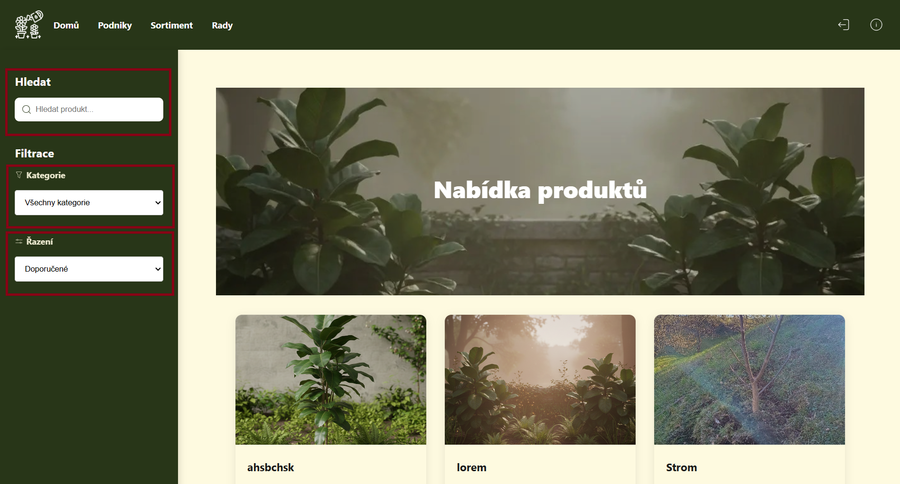
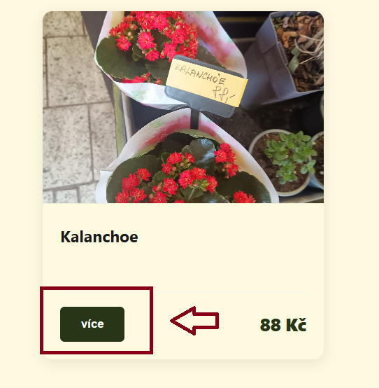

# Katalog a detaily položek {: #uzivatele }

Tato část aplikace slouží k popisu uživatelské části aplikace

---

## Katalog podniků a produktů {: #podniky }

Obě stránky využívají stejnou strukturu rozvržení:

* **Levé postranní menu:** 
    * **Vyhledávání:** Vyhledávání položek dle názvu
    * **Řazení:** Podniky lze řadit dle měst, produkty dle kategorií
    * **Filtrace:** Produkty lze filtrovat dle ceny a abecedy, podniky dle abecedy
* **Hlavní výpis (uprostřed):** Seznam karet s položkami. Pomocí tlačítka **Více** je uživatel přesměrován na detail konkrétní položky

    

* **Navigace (dole):** Tlačítka **Předchozí** a **Další** pro procházení stránek katalogu

### Ověření v systému ARES
Na kartě podniku se nachází ikonka, která indikuje důvěryhodnost:
* **Zelené zaškrtnutí:** Podnik je zaregistrovaný v systému ARES a jeho existence je ověřena.
* **Vykřičník:** Podnik nebyl ověřen přes IČO (údaje nemusí být kompletní nebo oficiální).

---

## Detail podniku {: #detail-podniku }

Na tuto stránku se dostanete kliknutím na tlačítko **Více** v kartě daného podniku.

1.  **Hlavička:** Zobrazuje profilový obrázek, popis podniku a kontaktní údaje na majitele.
2.  **Prostřední část:** Obsahuje otevírací hodiny a **interaktivní mapu** s přesnou adresou.
3.  **Nabídka (Sortiment):** V dolní části jsou zobrazeny záložky s kategoriemi produktů. 
    * Po rozkliknutí kategorie se zobrazí všechny produkty daného podniku.
    * K dispozici je pole pro vyhledání konkrétního produktu v rámci podniku.
    * Pro detail produktu stačí kliknout na tlačítko **Více** v kartě produktu.

---

## Detail produktu {: #sortiment-detail }

Stránka obsahuje podrobné informace o vybrané položce:

* **Popis:** Celý popis produktu, jeho kategorie a cena.
* **Dostupnost:** V prostřední části je karta podniku, který tento produkt nabízí, včetně mapy s adresou.
* **Související rady:** V dolní části naleznete odborné rady ke konkrétnímu produktu. Pomocí tlačítka **Více** přejdete na plné znění rady.

---

## Katalog rad {: #rady }

Poslední katalogovou stránkou je přehled odborných rad od všech uživatelů.

* **Filtrace a hledání:** V horní části nad radami lze filtrovat dle kategorií nebo vyhledávat textem.
* **Čtení rad:** Pro přečtení celé rady klikněte na tlačítko **Více** v kartě rady.

### Přidání nové rady {: #pridat-radu }
Pokud je uživatel přihlášen, zobrazí se mu speciální karta pro **přidání nové rady**

1. Po kliknutí je uživatel přesměrován na formulář

2. Zadá se **Název rady**, vybere se **Kategorie** (nepovinné) a vyplní se **Popis rady**

3. Po uložení se systém vrátí zpět do katalogu rad