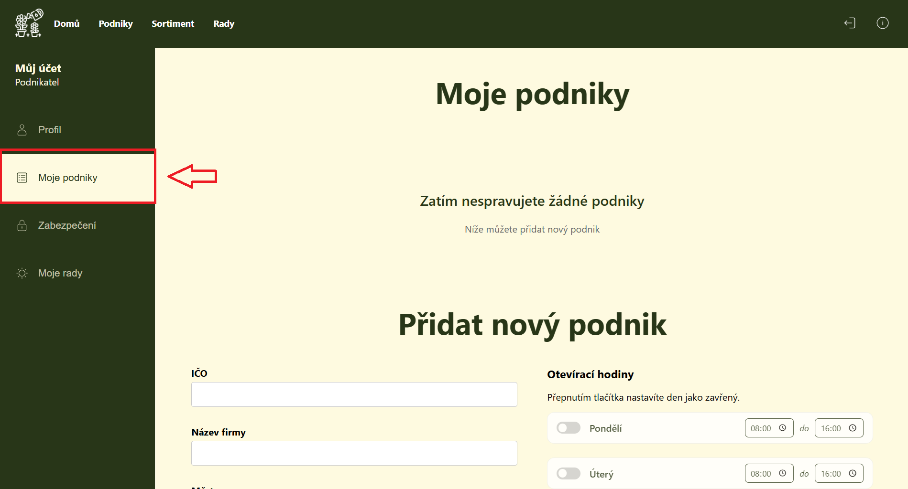
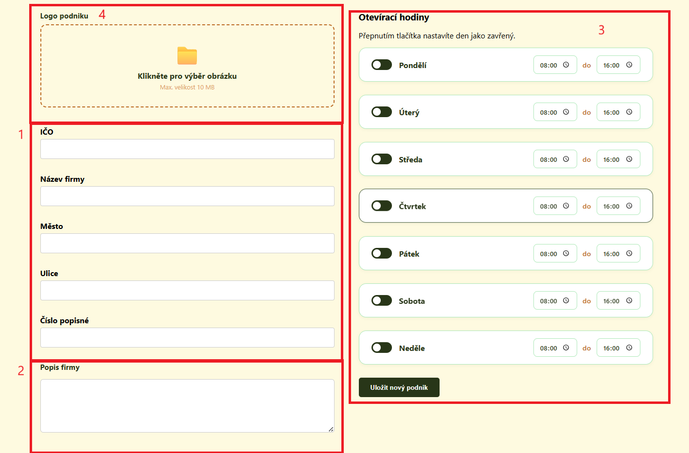
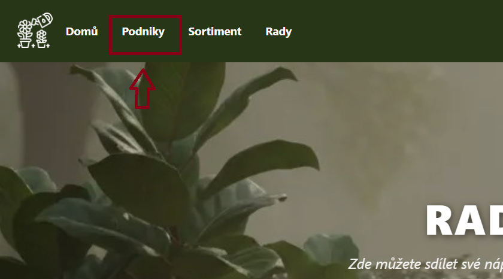
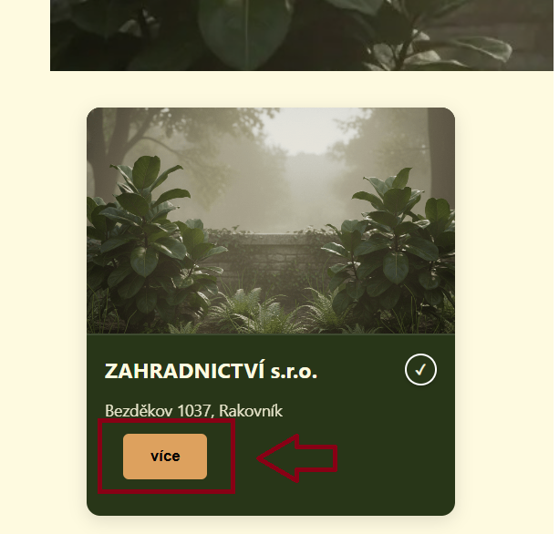
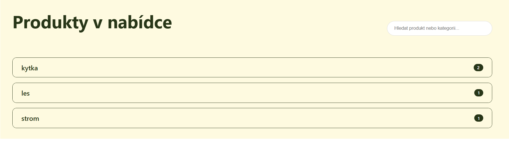
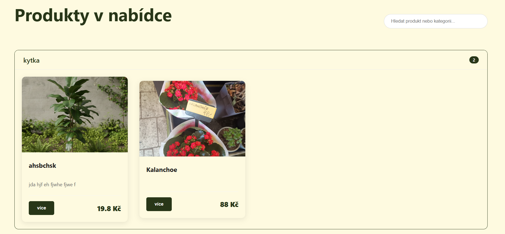

# Návody pro uživatele

V této sekci naleznete jednoduché postupy, jak využívat hlavní funkce webové aplikace.

---

## Přidání podniku {: #pridat-podnik }

Tento návod je určen pro uživatele s rolí **Podnik**, kteří chtějí do systému zaregistrovat svůj podnik.

### Postup k nalezení formuláře

1. **Přihlášení:** Nejprve se přihlaste ke svému účtu. Pokud účet ještě nemáte, je potřeba se [zaregistrovat](obrazovky.md#registrace)
2. **Vstup do správy:** Po [přihlášení](obrazovky.md#prihlaseni) klikněte na **ikonu informace** v pravé horní části menu

    

        
3. **Moje podniky:** V levém postranním menu vyberte záložku **Moje podniky**

    

4. **Vyhledání formuláře:** Na stránce sjeďte dolů pod seznam vašich stávajících podniků. Zde naleznete formulář pro přidání nového podniku

---

### Jak vyplnit formulář

Při vyplňování postupujte podle těchto bodů:

1. **Základní údaje:** Vyplňte **IČO**. V případě zadání správného a existujícího IČO formulář sám předvyplní **Název firmy** a kompletní adresu (**Město**, **Ulice**, **Číslo popisné**)

    !!! warning "Pozor"
        V případě, že nezadáte IČO, bude podnik označen jako neověřený

2. **Popis firmy:** Zde můžete stručně představit svůj podnik, uvést, na co se specializujete nebo jaké služby nabízíte
3. **Otevírací hodiny:**
    * Pro každý den můžete nastavit časové rozmezí **od–do**
    * **Přepínač (tlačítko):** Pokud přepínačem u daného dne vypnete barvu, nastavíte tím den jako **zavřený**
4. **Logo:** V dolní části (pod popisem) můžete nahrát logo vašeho podniku, které se bude následně zobrazovat v katalogu

**Dokončení:** Po vyplnění všech údajů klikněte na tlačítko **Uložit nový podnik**

**Hotovo:** Váš podnik je nyní uložen a ihned se zobrazí zákazníkům v sekci "Podniky"

## Produkty daného podniku {: #sortiment }

Tento postup slouží zákazníkům k rychlému nalezení aktuální nabídky konkrétního podniku

### Postup k nalezení sortimentu

1. **Katalog podniků:** V horním navigačním menu klikněte na položku **Podniky**

    

2. **Výběr podniku:** V seznamu najděte kartu podniku, který vás zajímá. Klikněte na tlačítko **Více**

    

3. **Detail podniku:** Ocitnete se na stránce s popisem a otevírací dobou. Sjeďte myší do dolní části stránky

4. **Kategorie:** Produkty jsou rozřazeny do kategorií. U každé kategorie vidíte název a počet produktů

    

5. **Rozbalení nabídky:** Klikněte na řádek s názvem vybrané kategorie. Tím se zobrazí konkrétní seznam produktů

    