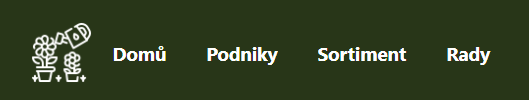
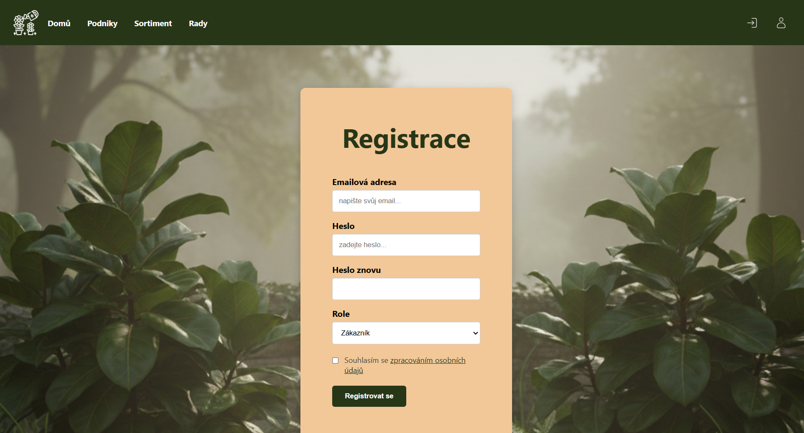
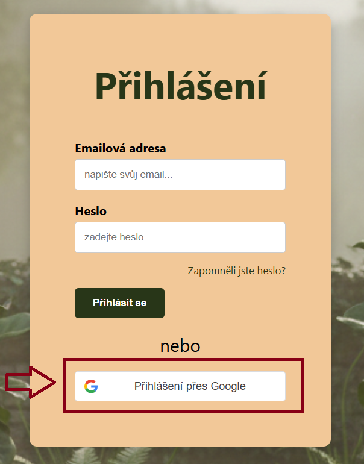
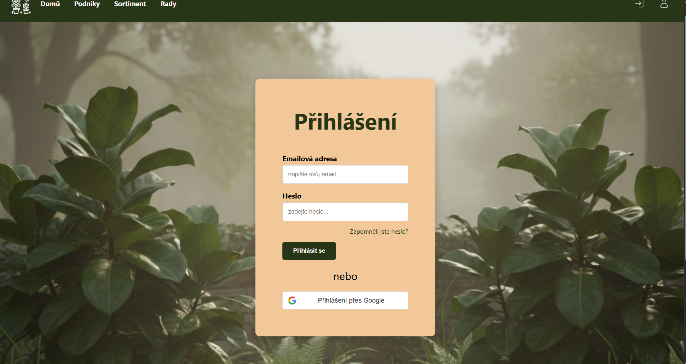

# Popis aplikace  {: #popis }

Tato webová aplikace slouží jako digitální platforma propojující lokální podniky v oblasti zahradnictví. Jejím hlavním cílem je usnadnit vyhledávání rostlin a zrahradního sortimentu ve vašem okolí a podpořit sdílení odborných rad v komunitě.

## Základní informace o aplikaci  {: #oaplikaci }

### Uživatelské role {: #role }
Systém rozlišuje dva typy uživatelů. Role se volí při registraci a určuje rozsah oprávnění:

* **Zákazník:** Uživatel, který systém využívá k prohlížení obsahu. Může vyhledávat v katalozích, číst rady a zobrazovat detaily podniků. Nemá oprávnění vytvářet vlastní nabídky. Může ale po přihlášení přidávat rady.
* **Zahradník:** Uživatel (obvykle majitel podniku), který kromě prohlížení obsahu může přidat svůj podnik a sortiment. Má přístup ke správě vlastních podniků a produktů.

### Podniky {: #podniky }
Podnik představuje profil reálného zahradnictví, květinářství nebo prodejny. Každý podnik obsahuje údaje jako IČO, adresa, otevírací doba a slouží jako náhrady webové stránky daného prodejce. Podnik je základním prvkem, ke kterému se váže veškerý nabízený sortiment.

### Produkty {: #produkty }
Produkty jsou konkrétní položky (rostliny, dřeviny, zahradnický materiál), které podniky nabízejí. Každý produkt je vázán na konkrétní podnik a obsahuje fotografii, cenu a popis. Produkty jsou kategorizovány pro snadné vyhledávání napříč celou aplikací. Odborníci také mohou využít možnosti propojení rady přímo s produktem.

### Rady {: #rady }
Sekce "Rady" tvoří znalostní bázi aplikace. Jsou to odborné články nebo krátké tipy týkající se pěstování rostlin.

## Hlavní navigace {: #navigace }

V horní části aplikace se nachází navigační lišta, která je dostupná z jakékoliv stránky. Umožňuje rychlý přístup k těmto sekcím:

* **Domů:** Odkaz na domovskou obrazovku
* **Podniky:** Seznam podniků v systému
* **Sortiment:** Přehled dostupného sortimentu
* **Rady:** Sekce s odbornými články a tipy pro zahradníky

    

#### Ikony v pravé části:
* **Ikona šipky s obdélníkem:** Slouží k rychlému přihlášení do aplikace, po přihlášení se změní na ikonku pro odhlášení
* **Ikona postavy:** Slouží pro registraci, po přihlášení se změní na ikonku "i" pro správu profilu

    

## Registrace {: #registrace }
* Aplikace umožňuje 2 způsoby registrace - klasický registrační formulář a pomocí Google účtu

### Registrační formulář

1. **E-mailová adresa:** Zadejte svůj funkční e-mail, který bude sloužit jako vaše přihlašovací jméno
2. **Heslo:** Zvolte si bezpečné heslo a pro kontrolu jej napište podruhé do pole **Heslo znovu**
3. **Výběr role:** Toto je nejdůležitější krok:
    * **Zákazník:** Vyberte, pokud si chcete prohlížet podniky a sortiment
    * **Zahradník:** Vyberte, pokud chcete přidat svůj podnik a propagovat sortiment
4. **Souhlas s podmínkami:** Kliknutím na odkaz si můžete přečíst, jak chráníme vaše osobní údaje. Poté zaškrtněte políčko souhlasu
5. **Dokončení:** Klikněte na tlačítko **Registrovat se**

### Přihlášení přes Google {: #google }

* V případě, že vlastníte Google účet můžete využít možnosti přihlášení přes něj
* Stačí kliknout na tlačítko "Přihlášení přes Google" a vybrat daný účet
* **Výběr role:** Pokud se přes Google přihlašujete poprvé (registrujete se), systém vás po přihlášení vyzve k výběru vaší role (**Zákazník** nebo **Podnik**), aby věděl, jaké funkce vám má zpřístupnit

## Přihlášení {: #prihlaseni }

Po úspěšné registraci se můžete do aplikace kdykoliv vrátit a přihlásit se ke svému účtu

### Způsoby přihlášení:

* **E-mailem a heslem:** Do formuláře vyplňte e-mail, který jste zadali při registraci, a vaše heslo. Poté klikněte na tlačítko **Přihlásit se**
* **Přes Google:** Pokud jste při registraci využili svůj Google účet (nebo ho chcete s aplikací propojit), stačí kliknout na tlačítko "Přihlášení přes Google"

### Zapomněli jste heslo? {: #zapomenute-heslo }
Pokud si nemůžete vzpomenout na své přístupové údaje, klikněte na odkaz **Zapomněli jste heslo?** přímo pod polem pro heslo. Systém vás přesměruje na stránku pro zadaní registračního e-mailu pro obnovu

