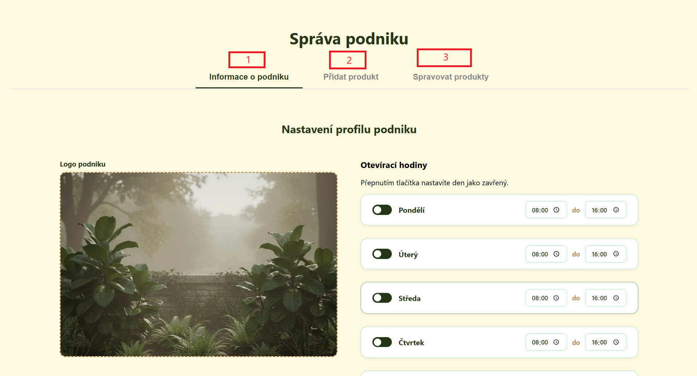
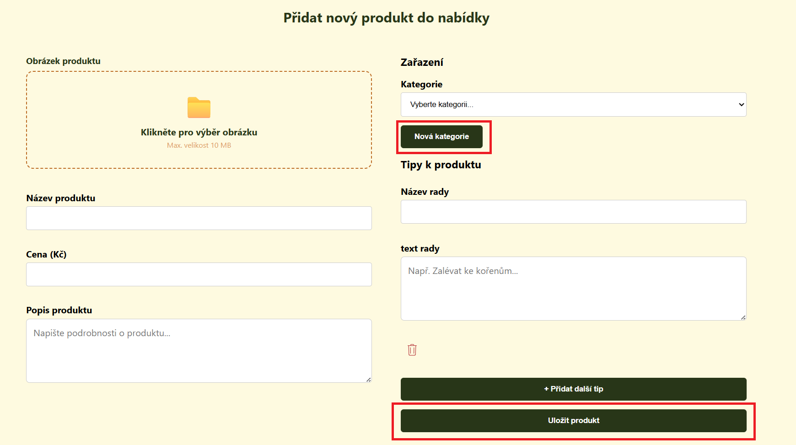
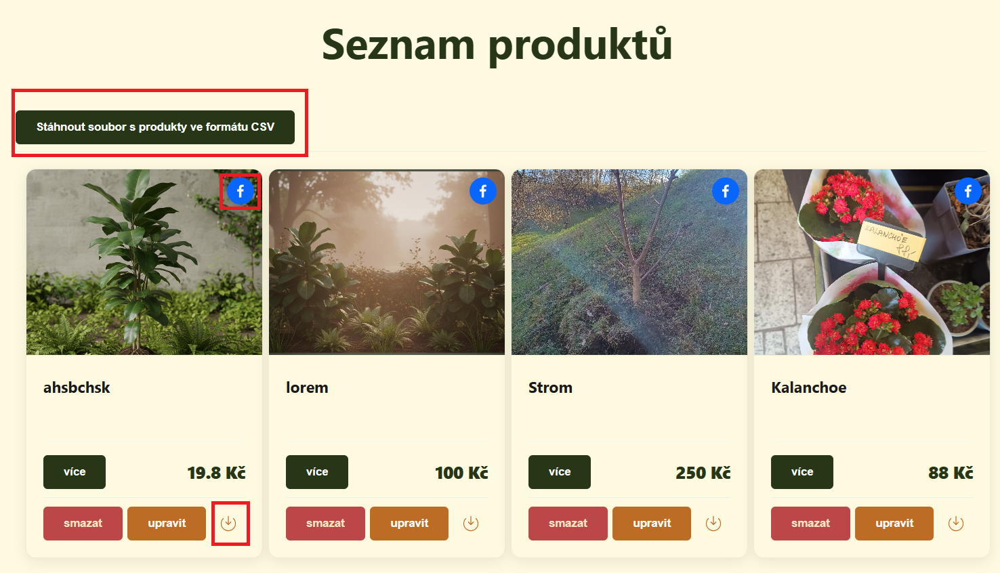
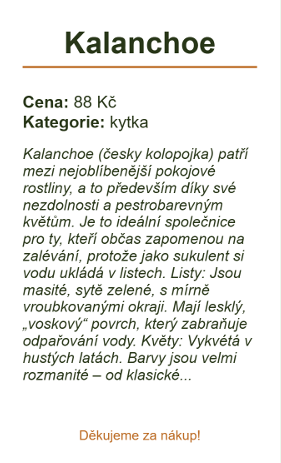

# Podniky

Tato stránka obsahuje detailní popis částí pro podniky

## Přidat podnik {: #pridat-podnik }

Více se dozvíte v kapitole [Přidání podniku](navody.md#pridat-podnik)

## Správa podniku

Tato stránka slouží jako hlavní pro váš podnik. Najdete zde tři hlavní sekce, které vám umožňují udržovat informace o podniku a sortimentu aktuální

### 1. Informace o podniku {: #upravit-podnik }

V této záložce můžete kdykoliv upravit základní údaje, které jste zadali při registraci firmy

* **Aktualizace informací o podniku:** Změna adresy, popisu firmy, otvíracích hodin nebo nahraného loga
* **Přidání kolegy:** Pokud chcete spravovat podnik společně se svými kolegy, můžete přidat kolegu do týmu. Daný kolega vám může pomoci se správou sortimentu, ale kvůli bezpečnosti již nemůže přidávat nebo odebírat kolegy a smazat podnik

!!! warning "Pozor"
    Uživatel musí být zaregistrovaný v aplikaci a musí mít roli podniku, aby mohl být přidán do týmu

### 2. Přidat produkt {: #pridat-produkt }
Záložka určená pro přidávání nových produktů

* **Nový sortiment:** Zde vložíte název produktu, popis, cenu a fotografii. Můžete ho také zařadit do kategorie a pokud se do žádné z nich nehodí můžete vytvořit novou přes tlačítko "Nová kategorie"

### 3. Spravovat produkty {: #produkty }
Zde vidíte **Seznam produktů**, které aktuálně nabízíte

* Nad seznamem produktů se nachází tlačítko pro **export produktů do CSV souboru**
* U každého produktu vidíte jeho název, náhledovou fotografii a aktuální cenu
* Kliknutím na tlačítko **"upravit"** se dostanete na stránku s formulářem pro úpravu produktu
* Kliknutím na tlačítko **"smazat"** jej můžete odstranit
* Kliknutím na **ikonku Facebooku** můžete sdílet odkaz s produktem na svůj Facebook
* Kliknutím na **ikonku pro stahování** můžete stáhnout etiketu produktu

